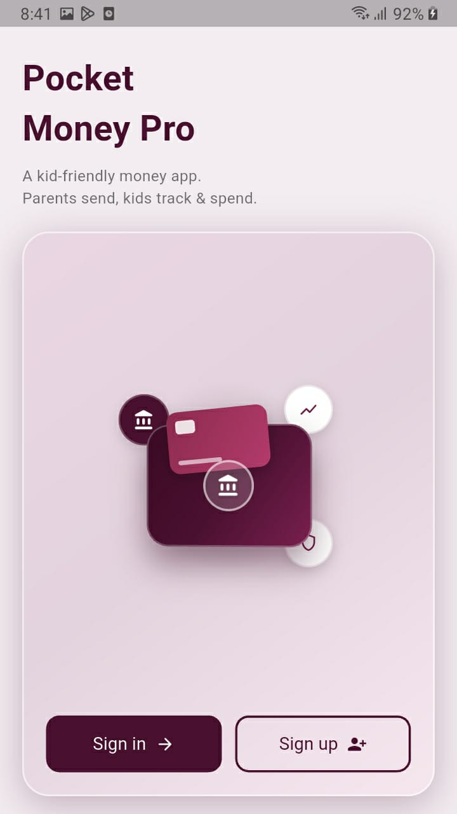
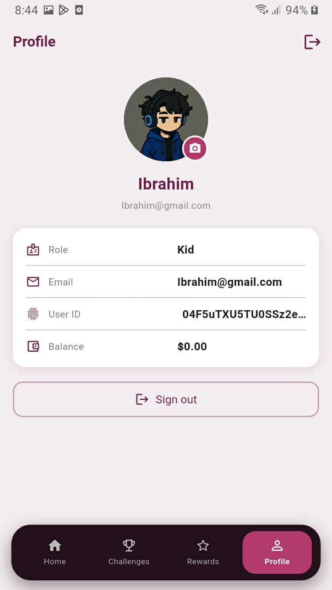
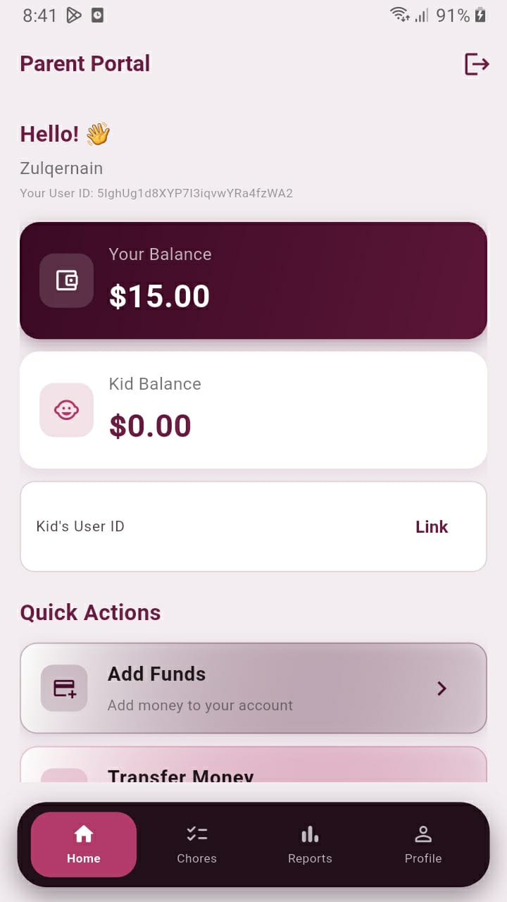
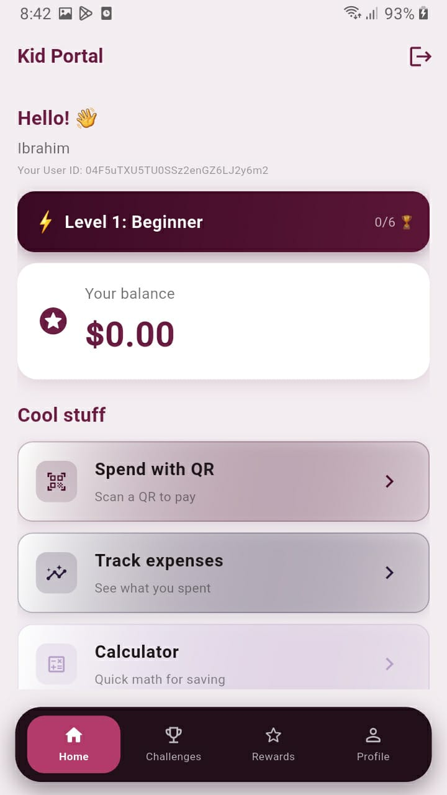
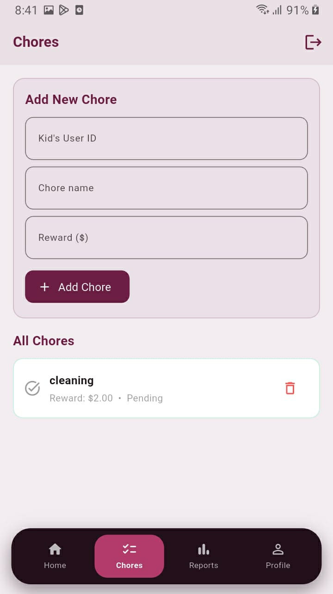
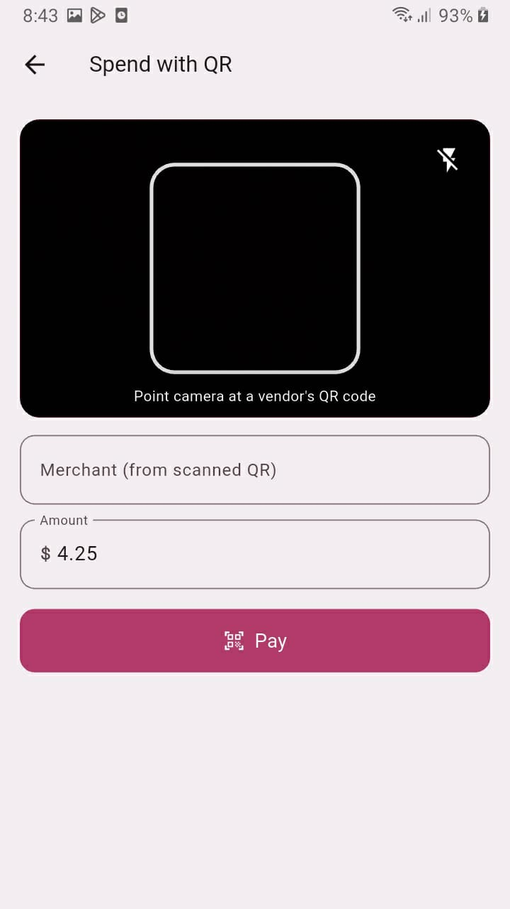

 # 💰 **Pocket Money Pro**

A kid-friendly finance app that helps parents send allowance and kids learn to track, save, and spend responsibly.

Parents send money and assign chores. Kids track their balance, complete challenges, and spend using QR codes — all in one simple, gamified experience.

<p align="center">
  
  
</p>

# Features

**Parent Portal**

Dashboard — view your balance and your kid's balance at a glance

Link Kid Account — connect your account to your child's using their User ID

Add Funds — top up your own wallet

Transfer Money — send allowance directly to your kid's balance

Chores — assign chores with a name and cash reward; track pending/completed status

Reports — view spending and activity reports

<p align="center">
  
</p>

**Kid Portal**

Dashboard — see current balance and level progress 

Spend with QR — scan a vendor's QR code and pay instantly by entering the amount

Track Expenses — view a history of what's been spent

Calculator — quick built-in calculator for saving/budgeting math

Challenges — complete tasks to level up and earn rewards

Rewards & Badges — earn badges for good financial habits

Wishlist — save up towards items you want

Piggy Bank — a savings feature separate from the main spending balance

Profile — view account info, role, email, User ID, and balance; sign out anytime

<p align="center">
  
</p>

# Account System
Secure sign up / sign in with Firebase Authentication

Separate roles for Parent and Kid accounts

Notifications system to keep users updated on transfers, chores, and rewards

# Tech Stack

**Frontend**

Flutter (Dart)
Android Studio / SDK for builds

**Backend**

Node.js + Express
RESTful API architecture (routes/ — auth, badges, chores, expenses, notifications, piggybank, QR payments, reports, transfer, vendor, wallet, wishlist)

**Authentication & Database**

Firebase Authentication
Firebase / Firestore for data storage

**Hosting**

Backend deployed on Railway

 # Project Structure
 
pocket-money-pro/

├── frontend/

│   ├── lib/

│   ├── android/

│   └── pubspec.yaml

└── money transfer backend/  

   ├── config/
   
   ├── routes/
   
   ├── auth.js
   
   ├── badges.js
   
   ├── chores.js
   
   ├── expenses.js
   
   ├── notifications.js
   
   ├── piggybank.js
   
   ├── qrpayments.js
   
   ├── reports.js
   
   ├── transfer.js
   
   ├── vendor.js
   
   ├── wallet.js
   
   |── wishlist.js
   
   ├── server.js
   
   └── package.json

<p align="center">
  
  
</p>

  # Getting Started

  **Backend**
  ```
  cd "money transfer backend"
  npm install
  ```

Set the following environment variable (Firebase service account credentials as a single-line JSON string):
  ```
FIREBASE_SERVICE_ACCOUNT=<your Firebase service account JSON>
  ```

Run the server:
 ```
node server.js
 ```

**Frontend**
 ```
cd frontend
flutter pub get
flutter run
 ```
Update the API base URL in the Flutter app's config to point to your backend (local or deployed) before running.

# Hosting Note

The backend is deployed on Railway's free trial tier for demo/portfolio purposes, since this is a student project. Because of this, the live backend may occasionally be inactive once free trial credits run out. If the API isn't responding, it's a hosting limitation, not a bug — the project can always be run locally following the steps above.

# Environment Setup

This project requires a Google/Firebase API key to run, which is not included in the repository for security reasons.

1. Create a file named `env.json` in the `frontend/` folder (this file is gitignored and won't be committed)
2. Add your key in this format:
```json
   {
     "GOOGLE_API_KEY": "your_firebase_web_api_key_here"
   }
```

3. Run the app with:
```bash
   flutter run --dart-define-from-file=env.json
```

# Project Purpose

Pocket Money Pro was built as a learning project exploring full-stack mobile development — combining a Flutter frontend, a custom Node.js/Express backend, Firebase authentication, and real-world concepts like QR-based payments, gamification, and parent-child account linking. It's designed for financial literacy: helping kids learn money management in a safe, virtual environment.
